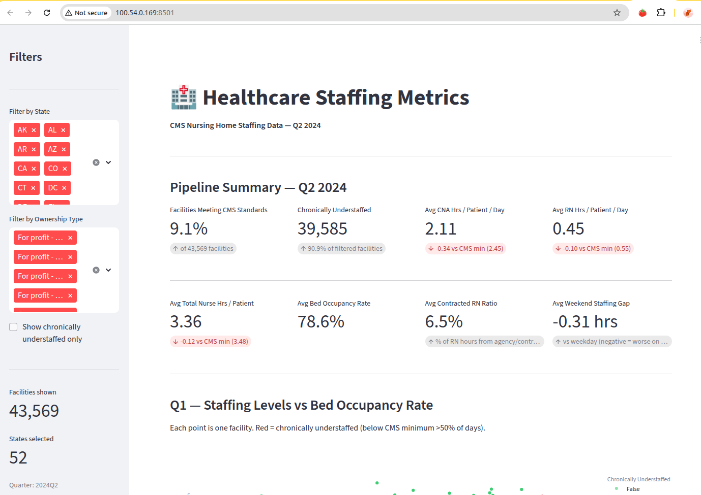

# Healthcare Metrics Pipeline

An end-to-end AWS data engineering pipeline and analytics dashboard built on
CMS nursing home staffing data (PBJ Q2 2024), designed to surface insights on
nurse availability, patient load, facility performance, and care quality across
U.S. nursing facilities.

**Dashboard:** Live on EC2 at port 8501  
**Pipeline:** AWS Glue Workflow (4 jobs, Delta Lake on S3)  
**Infrastructure:** Fully managed via AWS CDK — deploy or destroy with one command




---

## Documentation

| Document | Description |
|----------|-------------|
| [Architecture Design](docs/architecture_design.md) | Full solution design document — architecture decisions, SME feedback, implementation results (v2.3) |
| [Data Sources & Setup](docs/DATA.md) | Data file descriptions, download instructions, join keys, data dictionary reference |

---

## Architecture

```

+---------------------------------------------------+
|       Google Drive (source data)                  |
+---------------------------------------------------+
            |
            v  Glue Workflow — quarterly schedule trigger
+---------------------------------------------------+
|  Job 1: Glue Python Shell                         |
|  Google Drive API → S3 Bronze                     |
|  - Authenticates via service account (Secrets Mgr)|
|  - Incremental: detects new quarters only         |
+---------------------------------------------------+
            |                                        
            v  Trigger: ingestion SUCCEEDED          
+---------------------------------------------------+
|  Job 2: Glue Spark                                |
|  S3 Bronze → S3 Silver (Delta Lake)               |
+---------------------------------------------------+
            |                                        
            v  Parallel triggers: Bronze SUCCEEDED
+---------------------------------------------------+
|  Job 3: Glue Spark   Job 4: Glue Spark            |
|  Silver →            Silver →                     |
|  facility_summary    staffing_metrics             |
|  (Delta Lake)        (Delta Lake)                 |
+---------------------------------------------------+
            |
            v
+---------------------------------------------------+
|   Streamlit Dashboard — EC2 t3.small — port 8501  |
+---------------------------------------------------+
```

All infrastructure defined in `infrastructure/infrastructure/healthcare_stack.py`
and deployed via AWS CDK.

---

## Project Structure

```
healthcare-metrics/
├── data/
│   └── raw/                         <- CMS CSV files (not tracked by Git)
├── src/
│   └── pipeline/                    <- Glue ETL scripts
│       ├── glue_ingestion.py        <- Google Drive API ingestion
│       ├── glue_bronze_to_silver.py <- Bronze to Silver transformation
│       ├── glue_silver_to_facility_summary.py   <- Gold: facility level
│       └── glue_silver_to_staffing_metrics.py   <- Gold: daily level
├── dashboard/
│   └── app.py                       <- Streamlit dashboard
├── infrastructure/
│   ├── app.py                       <- CDK entry point
│   ├── .env.example                 <- Environment variable template
│   ├── infrastructure/
│   │   └── healthcare_stack.py      <- All AWS resources defined here
│   └── scripts/
│       └── ec2_setup.sh             <- EC2 bootstrap script
├── scripts/
│   └── create_q3_test_data.py       <- Test data generator for new quarters
├── docs/
│   ├── architecture_design.md       <- Pipeline architecture (v2.3)
│   ├── DATA.md                      <- Data sources and setup guide
│   └── NH_Data_Dictionary.pdf       <- CMS column reference
├── environment.yml                  <- Data analysis conda env (dea-cdk)
└── README.md
```

---

## Setup

### 1. Clone the repository

```bash
git clone https://github.com/MarianoB/healthcare_metrics_analysis.git
cd healthcare_metrics_analysis
```

### 2. Configure environment variables

```bash
cp infrastructure/.env.example infrastructure/.env
# edit .env and fill in your values
```

Required variables:

| Variable | Description |
|----------|-------------|
| `HEALTHCARE_AWS_ACCOUNT` | Your AWS account ID |
| `HEALTHCARE_AWS_REGION` | AWS region (e.g. us-east-1) |
| `HEALTHCARE_DRIVE_FOLDER_ID` | Google Drive folder ID containing CMS CSV files |

### 3. Python Conda environment

```bash
conda env create -f environment.yml
conda activate dea-cdk
```

---

## Google Drive Ingestion Setup

The pipeline ingests data from Google Drive using a service account. To set up:

1. Create a Google Cloud project and enable the Google Drive API
2. Create a service account and download the JSON key file
3. Share your Google Drive data folder with the service account email
4. Store the JSON key in AWS Secrets Manager:

```bash
aws secretsmanager create-secret \
    --name "healthcare/google-drive-credentials" \
    --secret-string file:///path/to/your-key.json \
    --region us-east-1
```

5. Set `HEALTHCARE_DRIVE_FOLDER_ID` in `infrastructure/.env` to your folder ID

See [Architecture Design](docs/architecture_design.md) Section 10 for full details.

---

## Deploy Infrastructure

```bash
conda activate dea-cdk
cd infrastructure
cdk deploy     # create all AWS resources
cdk destroy    # tear down everything when done
```

> The S3 bucket uses `RemovalPolicy.RETAIN` — your data is safe on `cdk destroy`.

---

## Running the Pipeline

**Trigger full pipeline manually:**
```bash
aws glue start-workflow-run --name healthcare-metrics-pipeline
```

**Monitor workflow:**
```bash
aws glue get-workflow \
    --name healthcare-metrics-pipeline \
    --include-graph \
    --query "Workflow.LastRun.{Status:Status, Stats:Statistics}"
```

**Run individual jobs:**
```bash
# ingestion only
aws glue start-job-run --job-name healthcare-ingestion

# bronze to silver only
aws glue start-job-run \
    --job-name healthcare-bronze-to-silver \
    --arguments '{
        "--BUCKET_NAME": "mbeccaria-dea-healthcare-metrics",
        "--BRONZE_PATH": "s3://mbeccaria-dea-healthcare-metrics/bronze/quarter=2024Q2/",
        "--SILVER_PATH": "s3://mbeccaria-dea-healthcare-metrics/silver/staffing/",
        "--AUDIT_PATH":  "s3://mbeccaria-dea-healthcare-metrics/audit/unmatched_ccn/",
        "--QUARTER":     "2024Q2"
    }'
```

---

## Running the Dashboard Locally

```bash
conda activate dea-cdk
cd dashboard
streamlit run app.py
```

Dashboard reads directly from Gold Delta Lake tables on S3 using your AWS credentials.


---

## Project Steps

| Step | Description | Status |
|------|-------------|--------|
| 1 | Source data download and S3 upload | ✅ Done |
| 2 | EDA — data quality, join analysis, CMS thresholds | ✅ Done |
| 3 | Architecture design (v2.3 — SME approved) | ✅ Done |
| 4 | CDK infrastructure + Glue ETL scripts + Google Drive ingestion | ✅ Done |
| 5 | Metrics calculated in Gold layer | ✅ Done |
| 6 | Streamlit dashboard — live on EC2 | ✅ Done |
| 7 | Documentation and submission | 🔄 In progress |

---

## Key Findings

- Only **24.5%** of facility-days meet CMS minimum staffing thresholds
- **90.9%** of facilities are chronically understaffed
- Average CNA hours **(2.11)** fall below CMS minimum **(2.45)** nationally
- **Government facilities** consistently outperform all for-profit ownership types
- **Weekend staffing** is consistently worse than weekday by -0.31 hrs on average
- **Texas** had 15 facilities chronically understaffed for the entire Q2 2024 quarter

---

## CMS Minimum Staffing Thresholds (2024 Rule)

| Staff Type | CMS Minimum |
|-----------|-------------|
| CNA | 2.45 hrs/patient/day |
| RN | 0.55 hrs/patient/day |
| Total nurses | 3.48 hrs/patient/day |

---

## Tech Stack

| Layer | Tool | Why |
|-------|------|-----|
| Language | Python 3.11 | Industry standard for data engineering |
| Ingestion | Google Drive API + Glue Python Shell | Connects to source data, incremental load |
| ETL | AWS Glue PySpark 3.3 | Distributed processing for 1.3M+ rows |
| Storage | Amazon S3 + Delta Lake | ACID transactions, incremental MERGE, time travel |
| Orchestration | AWS Glue Workflow + Triggers | Single service, conditional chaining |
| Infrastructure | AWS CDK (Python) | Full IaC — repeatable, version controlled |
| Dashboard | Streamlit on EC2 t3.small | Simple always-on deployment |
| Credentials | AWS Secrets Manager | Secure storage for Google Drive service account key |
| Monitoring | AWS CloudWatch | One log group per Glue job |

---

## Environments

| File | Env name | Purpose |
|------|----------|---------|
| `environment.yml` | `dea-cdk` | Data analysis — pandas, numpy, EDA scripts, CDK + Infrastructure deployment |